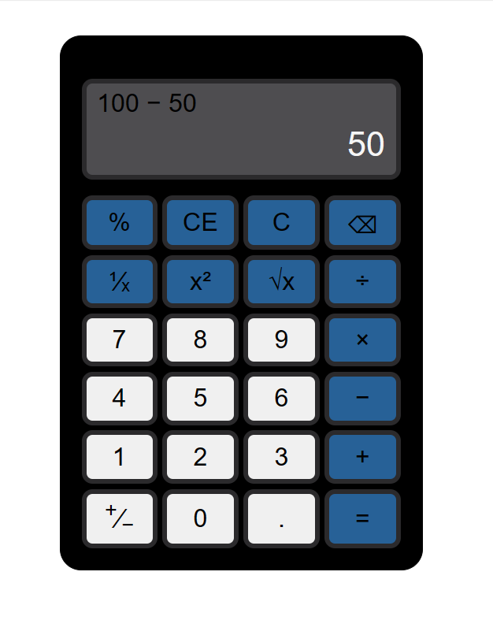

# Web-Based Calculator


## Overview

This project presents a web-based calculator, inspired by the Windows calculator. The application features server-side logic built with Spring Boot on the backend and a Vue.js frontend.


---


## **Features**

- **Basic Arithmetic Operations:** Addition, subtraction, multiplication, and division.
- **Additional Operations:** Percentage, fraction, square, square root, and negation.
- **Exception Handling:** Robust error handling for scenarios like division by zero, displaying 'E' as an indicator.
- **User-Friendly Interface:** Web buttons for intuitive user interaction.

---

## **Technologies Used**

- **Vue.js:** The frontend leverages Vue.js to provide a dynamic and responsive user interface.
- **Spring Boot:** The backend is developed with Spring Boot, a Java-based framework, handling server-side logic and REST API endpoints.
- **Fetch API:** Enables communication between the frontend and backend for performing calculations.

---

## **Vue.js Code Overview**

### **`data()`**

The **`data()`** function initializes the component's data properties, including expressions, current numbers, and various flags used during calculations.

```jsx
data() {
    return {
        expression: '',
				currNum: '',
				firstOperand: '',
				operator: false,
				operatorDone: false,
				done: false,
				prevSingle: false,
				temp: '',
    }
}
```

### **Important Methods**

### **`clear()`**

The **`clear()`** method resets the calculator's state, clearing the expression, current number, and other relevant properties.

```jsx
clear() {
    this.expression = '';
    this.currNum = '';
    this.firstOperand = '';
    this.operator = false;
    this.operatorDone = false;
    this.prevSingle = false;
    this.done = false;
}
```

### **`clearE()`**

The **`clearE()`** method resets the current number.

```jsx
clearE() {
		if(this.currNum==='E' || this.done) this.clear();
		else this.currNum = '';
    this.prevSingle = false;
}
```

### **`deleting()`**

The **`deleting()`** method handles the backspace functionality, allowing users to delete the last digit or operator.

```jsx
deleting() {
    if(this.currNum==='E' || this.done){
        this.clear();
    } 
    if (!((this.currNum === '' && this.operator)||this.operatorDone || this.prevSingle)) {
        this.currNum = this.currNum.slice(0, -1);
    }  
}
```

### **`appendNum(num)`**

The **`appendNum(num)`** method handles the input of numeric values, updating the current number displayed on the calculator.

```jsx
appendNum(num) {
    if(this.currNum==='E') this.clear();
    if(this.done) {
        this.clear();
    }
    if (this.prevSingle) {
        this.clearE();
    }
    if(this.operatorDone) {
        this.firstOperand = this.currNum;
        this.currNum = '';
        this.operatorDone = false;
    }
    if (num === '.' && this.currNum.includes('.')) return;
    
    if (this.currNum === '0') this.deleting();
    if (num === '.' && this.currNum === '') this.currNum = '0';
    this.currNum += num;
}
```

### **`singleOperation(op)`**

The **`singleOperation(op)`** method handles unary operations like square, square root, and negation.

```jsx
async singleOperation(op) {
    if (this.currNum !== '' && this.currNum !== 'E') {
        await fetch(`http://localhost:8081/`+op+`/`+this.currNum, {
            method: 'get',
        }).then(res => {
            return res.text();
        }).then(data => {
            if (op === 'percent' && this.firstOperand !== '' && (this.expression[this.expression.length - 1] === '+' || this.expression[this.expression.length - 1] === '−')) {
                this.currNum = this.firstOperand * data;
            }
            else {
                this.currNum = data;
            }
        });
        if (this.done) {
            this.temp = this.currNum;
            this.clear();
            this.currNum = this.temp;
        }
        this.operatorDone = false;
        this.prevSingle = true;
    }
}
```

### **`doubleOperation(op, opSymbol)`**

The **`doubleOperation(op, opSymbol)`** method handles binary operations like addition, subtraction, multiplication, and division.

```jsx
async doubleOperation(op,opSymbol) {
    if (this.currNum === '' || this.currNum === 'E') return;
    if (this.done) {
        this.temp = this.currNum;
        this.clear();
        this.currNum = this.temp;
    }
    if (!this.operator) {
        this.prevSingle = false;
        this.firstOperand = this.currNum;
        this.expression = this.expression + ' ' + this.firstOperand + ' ' + opSymbol;
        this.operator = true;
        this.currNum = '';
    } else if (!this.operatorDone){
        this.prevSingle = false;
        this.expression = this.expression + ' ' + this.currNum;
        await fetch(`http://localhost:8081/`+this.expression, {
            method: 'get',
        }).then(res => {
            return res.text();
        }).then(data => {
            this.currNum = data;
        });
        if (this.currNum !== 'E') {
            this.expression = this.expression + ' ' + opSymbol;
        }
        this.firstOperand = this.currNum;
        this.operator = true;
        this.operatorDone = true;
    }
    else {
        this.expression = this.expression.slice(0, -1);
        this.expression = this.expression + ' ' + opSymbol;
    }
}
```

### **`equal()`**

The **`equal()`** method calculates the result when the equal button is pressed.

```jsx
equal(){
    if (!this.done && this.currNum !== '' && this.currNum !== 'E') {
        if (this.operator) {
            this.expression = this.expression + ' ' + this.currNum;
            fetch(`http://localhost:8081/`+this.expression, {
                method: 'get',
            }).then(res => {
                return res.text();
            }).then(data => {
                this.currNum = data;
            });
        }
        this.done = true;
    }
}
```

### **Frontend Structure**

The Vue.js frontend is organized with components and styles, providing a clean and modular structure for the calculator interface.

- **Components:** The **`Calculator.vue`** component encapsulates the main logic and UI for the calculator.
- **Styles:** Styles for the calculator are defined within the component's **`<style>`** section.

---

## **Spring Boot Code Overview**

### **`CalculatorService.java`**

### **`expressionSolver(...)`**

The **`expressionSolver(...)`** method in the **`CalculatorService`** class performs the actual arithmetic calculations for double-operand operations.

```java
public String expressionSolver(String expression) {
    try {
        expression = expression.replaceAll("÷", "/").replaceAll("×", "*").replaceAll("−", "-");
        double result = parser.parseExpression(expression).getValue(Double.class);
        if (result == (long) result) {
            return String.format("%d", (long) result);
        }
        return String.valueOf(result);
    } catch (Exception e) {
        return "E";
    }
}
```

### **`singleOperation(...)`**

The **`singleOperation(...)`** method in the **`CalculatorService`** class performs the actual calculations for single-operand operations.

```java
public String singleOperation(String operation, double operand) {
    double result = 0.0;
    switch (operation) {
        case "square":
            result = operand * operand;
            break;
        case "squareRoot":
            if (operand < 0) {
                return "E";
            } else {
                result = Math.sqrt(operand);
            }
            break;
        case "fraction":
            if (operand == 0) {
                return "E";
            } else {
                result = 1.0 / operand;
            }
            break;
        case "negate":
            result = -operand;
            break;
        case "percent":
            result = operand / 100.0;
            break;
    }
    if (result == (long) result) {
        return String.format("%d", (long) result);
    }
    return String.valueOf(result);
}
```

## **Backend Structure**

The Spring Boot backend follows a modular structure:

- **Application Class:** The **`CalculatorApplication.java`** class serves as the entry point for the Spring Boot application.
- **Controller:** The **`CalculatorController.java`** class defines REST endpoints for calculator operations.
- **Service:** The **`CalculatorService.java`** class implements the calculator's logic.

> The backend server will be available at **`http://localhost:8081/`**.
> 

---

## **API Endpoints**

### **Double Operation (Arithmetic)**

Perform double-operand arithmetic operations (add, subtract, multiply, divide).

**Endpoint:** **`/{expression}`**

```java
@GetMapping("{expression}")
public String expressionSolver(@PathVariable("expression") String expression) {
    return calculatorService.expressionSolver(expression);
}
```

### **Single Operation (Unary)**

Perform single-operand operations (square, square root, fraction, negate, percentage).

**Endpoint:** **`/{operation}/{operand}`**

```java
@GetMapping("{operation}/{operand}")
public String singleOperation(@PathVariable("operation") String operation,
        @PathVariable("operand") double operand) {
    return calculatorService.singleOperation(operation, operand);
}
```

---
